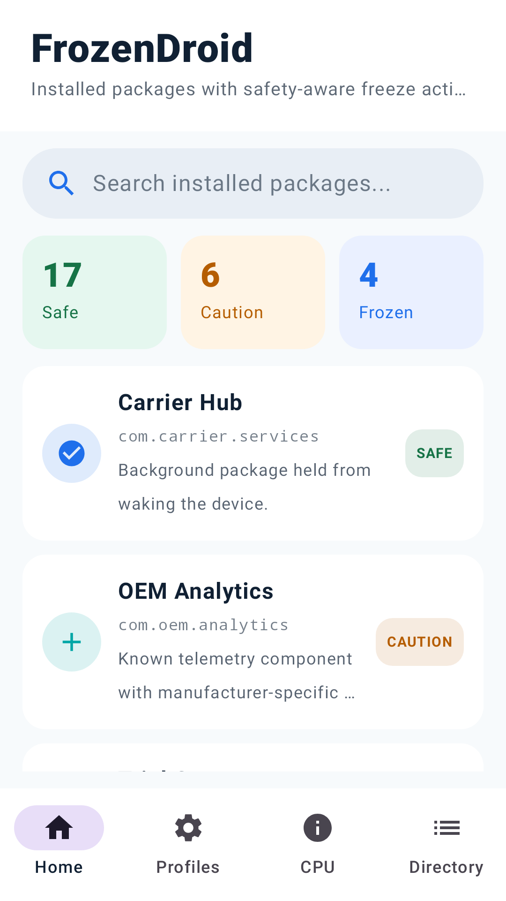
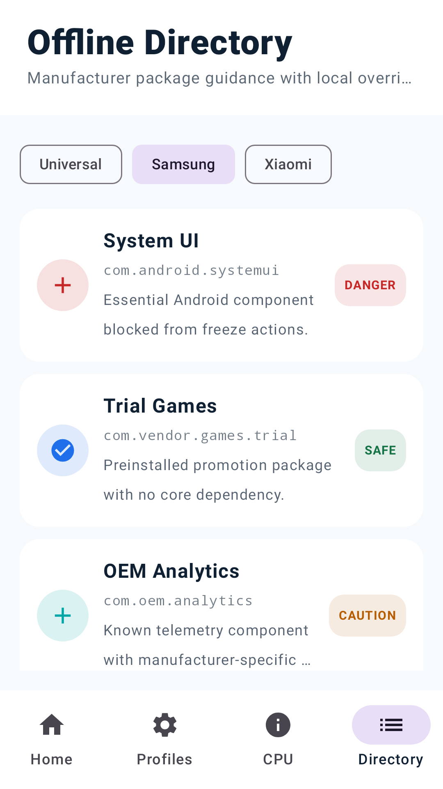
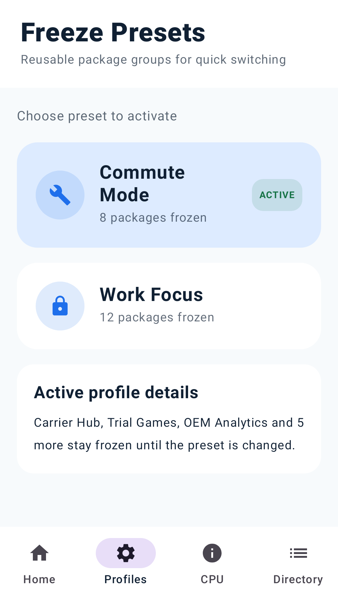
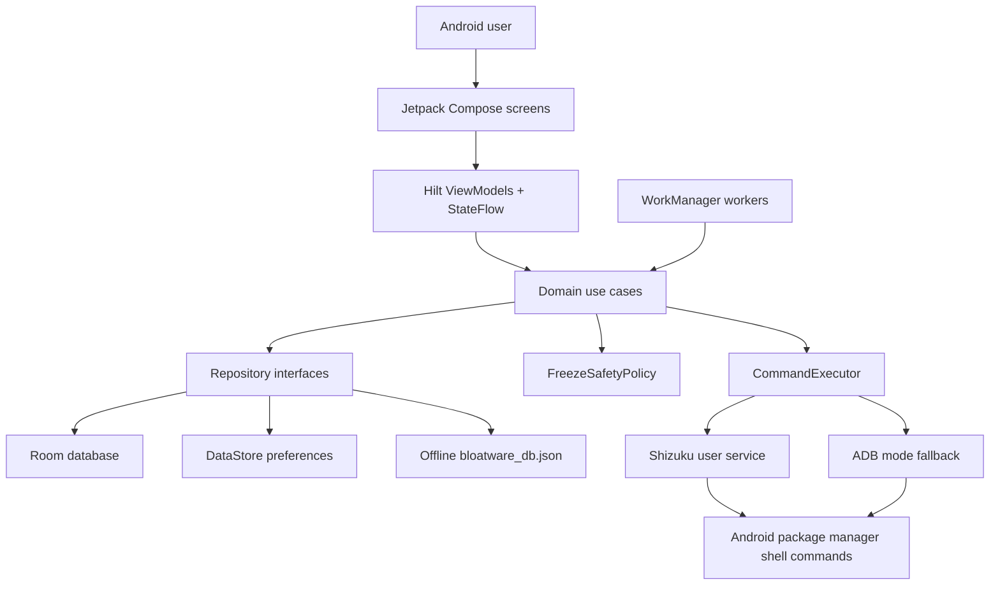

# FrozenDroid

[](#testing)
[](#license)
[](app/build.gradle.kts)
[](#testing)
[](https://github.com/michaelsam94/FrozenDroid)
[](https://github.com/michaelsam94/FrozenDroid/issues)

FrozenDroid is a no-root Android utility for reviewing, freezing, and restoring installed packages that waste battery or run unwanted background services. It is built for Android power users who want Shizuku-assisted package control, offline safety guidance, reusable freeze profiles, and CPU wake telemetry without sending app data to a backend.

No hosted demo is configured. The repository includes generated Google Play assets for reviewing the current app experience.

<table>
  <tr>
    <td></td>
    <td></td>
    <td></td>
  </tr>
</table>

## Project Overview

FrozenDroid helps users make safer package-management decisions on Android devices with OEM, carrier, or social-app bloatware. The app combines a local package inventory, an offline safety directory, protected-package rules, profile workflows, and telemetry views so users can disable noise while avoiding core system components.

This folder contains the Android app. In the parent workspace, the Netlify-ready privacy-policy site lives in `../FrozenDroid-pv/`.

## Key Features

- 🧊 Freeze and unfreeze packages through Shizuku-backed `pm disable-user` and `pm enable` commands.
- 🛡️ Block dangerous system packages with a hard-coded safety policy before command execution.
- 📚 Load an offline bloatware catalog from `bloatware_db.json` with safety levels, reasons, and affected features.
- 🔎 Refresh installed-package inventory, including disabled packages, into a local Room database.
- 👤 Save user safety overrides and profile state with Room and DataStore.
- 📊 Parse CPU wake telemetry to help identify packages that keep waking the device.
- 🧭 Provide built-in Shizuku privilege-state handling and setup guidance when access is degraded.
- 🏪 Generate Google Play screenshots, an app icon, and a feature graphic with Roborazzi-backed tests.

## Architecture Overview



### Components

| Component | Location | Responsibility |
| --- | --- | --- |
| Presentation | `app/src/main/java/.../presentation/ui` | Compose screens, navigation, ViewModels, and UI state. |
| Domain | `app/src/main/java/.../domain` | Package models, repository contracts, safety rules, and use cases. |
| Data | `app/src/main/java/.../data` | Room entities/DAOs, local repositories, and DataStore preferences. |
| Framework | `app/src/main/java/.../framework` | Shizuku service binding, shell command execution, telemetry parsing, and workers. |
| Assets | `app/src/main/assets` | Offline bloatware package catalog used by the Safe Directory. |
| Store assets | `play-store/` | Generated icon, feature graphic, screenshots, and listing copy. |

### Request And Data Flow

1. Compose screens call ViewModel actions for package refresh, freeze, unfreeze, profile, or telemetry operations.
2. ViewModels delegate to domain use cases such as `FreezeAppUseCase`, `UnfreezeAppUseCase`, and `MonitorCpuWakeUseCase`.
3. Use cases validate safety through `FreezeSafetyPolicy` before a package-changing command runs.
4. Repositories combine local Room rows, user overrides, and the static bloatware catalog into app-facing models.
5. `CommandExecutorImpl` prefers a live Shizuku binder and falls back to the configured ADB mode when selected.
6. WorkManager workers run background freeze, profile-switch, and CPU-monitoring work.

### Design Patterns

- Clean Architecture-style layering separates UI, domain logic, data access, and Android framework integrations.
- Repository interfaces keep ViewModels and use cases independent from Room, assets, and shell execution details.
- Hilt provides application, database, executor, and repository dependencies.
- StateFlow/DataStore streams keep UI state reactive and local-first.

## Tech Stack & Libraries

| Layer | Technology | Version | Purpose |
| --- | --- | --- | --- |
| Language | Kotlin | 2.1.0 | Primary Android implementation language. |
| Build | Gradle Wrapper | 9.5.1 | Reproducible local builds. |
| Android plugin | Android Gradle Plugin | 9.1.1 | Android application build and packaging. |
| SDK | Android SDK | compile 36.1, min 24, target 36 | Device compatibility and platform APIs. |
| UI | Jetpack Compose BOM | 2024.09.00 | Declarative UI toolkit. |
| UI | Material 3 | Compose BOM-managed | App components and design system. |
| Navigation | Navigation Compose | 2.8.9 | In-app route management. |
| DI | Hilt | 2.57 | Dependency injection. |
| Storage | Room | 2.7.0 | Local package, profile, telemetry, and override persistence. |
| Storage | DataStore Preferences | 1.1.7 | User settings and privilege mode storage. |
| Background work | WorkManager KTX | 2.9.0 | Scheduled freeze, profile, and telemetry workers. |
| Privileged commands | Shizuku | 13.1.5 | No-root package-manager command bridge. |
| Networking utilities | OkHttp / Retrofit / Moshi | 4.10.0 / 2.12.0 / 1.15.2 | Available dependencies for typed HTTP clients and JSON parsing. |
| Tests | JUnit / Robolectric / Roborazzi | 4.13.2 / 4.16.1 / 1.59.0 | Unit, Android-resource, and screenshot asset tests. |

## Prerequisites

| Requirement | Version / Notes |
| --- | --- |
| OS | macOS, Linux, or Windows with Android Studio-compatible tooling. |
| JDK | Java 11 or newer; the project compiles Java/Kotlin bytecode for JVM 11. |
| Android Studio | Recommended for SDK, emulator, and device tooling. |
| Android SDK | Compile SDK 36 with minor API 1 if using the current build file. |
| ADB | Required for device install, instrumentation tests, and optional wireless ADB flow. |
| Shizuku | Recommended on the target Android device for no-root package commands. |

### Environment Variables

| Variable | Required | Default | Description |
| --- | --- | --- | --- |
| `ANDROID_HOME` | Usually | Android Studio SDK path | Android SDK location when Gradle cannot infer it. |
| `KEYSTORE_PATH` | Release only | `my-upload-key.jks` | Release signing keystore path. |
| `KEY_ALIAS` | Release only | `upload` | Release signing key alias. |
| `STORE_PASSWORD` | Release only | Not configured | Release keystore password. |
| `KEY_PASSWORD` | Release only | Not configured | Release key password. |
| `GEMINI_API_KEY` | No current runtime requirement | `MY_GEMINI_API_KEY` in `.env.example` | Read by the secrets plugin if Gemini-backed features are added. |

## Installation & Setup

1. Clone the repository and enter the Android app folder.

   ```bash
   git clone https://github.com/michaelsam94/FrozenDroid.git
   cd FrozenDroid
   ```

   If you are working from the parent workspace used by this project, enter the app folder instead:

   ```bash
   cd FrozenDroid
   ```

2. Create a local secrets file from the example.

   ```bash
   cp .env.example .env
   ```

3. Confirm the Android SDK and Gradle wrapper are available.

   ```bash
   ./gradlew --version
   ./gradlew tasks
   ```

   Android Studio may create `local.properties` automatically. Do not commit machine-specific SDK paths.

4. Build a debug APK.

   ```bash
   ./gradlew assembleDebug
   ```

5. Install on a connected device or emulator.

   ```bash
   adb devices
   ./gradlew installDebug
   ```

6. Set up Shizuku on the device.

   Install Shizuku from Google Play, enable Developer Options and Wireless Debugging, pair Shizuku, start the service, and grant FrozenDroid permission when prompted.

7. Database setup.

   Not applicable. FrozenDroid uses an app-local Room database that is created on device at runtime.

8. Development server.

   Not applicable for the Android app. The privacy-policy site in the parent workspace can be previewed with `python3 -m http.server`.

## Configuration

| Location | Purpose | Restart Required |
| --- | --- | --- |
| `.env` | Secrets Gradle Plugin input; currently mirrors `.env.example`. | Re-run Gradle tasks after changes. |
| `local.properties` | Local Android SDK path created by Android Studio or Gradle tooling. | Re-run Gradle tasks after changes. |
| `key.properties` | Optional local release-signing values. | Re-run release build after changes. |
| `app/build.gradle.kts` | App ID, SDK levels, version, signing, tests, and build features. | Rebuild required. |
| `app/src/main/assets/bloatware_db.json` | Offline package safety catalog. | Reinstall or clear app data after asset changes. |
| `app/src/main/res/values/strings.xml` | App name and localized strings. | Rebuild required. |

Runtime user preferences are stored in DataStore under `frozendroid_settings`. Package inventory, profiles, telemetry events, and safety overrides are stored in the Room database.

## Usage / Quick Start

### Build And Install The Android App

```bash
./gradlew assembleDebug
./gradlew installDebug
```

After installing, start Shizuku on the target device and open FrozenDroid. The app listens for Shizuku binder availability and records the privilege mode as `SHIZUKU`, `ADB`, or `DEGRADED`.

### Freeze And Restore A Package

```kotlin
val blocked = FreezeSafetyPolicy.blockReason("com.android.systemui")
check(blocked != null)

val result = commandExecutor.freeze("com.samsung.android.bixby.agent")
```

The app validates package names and protected-package rules before it calls `pm disable-user --user 0 <package>` through Shizuku or the selected ADB flow.

### Generate Play Store Assets

```bash
./gradlew generatePlayStoreAssets
```

Generated screenshots and graphics are written to `play-store/`. The existing listing copy is available at [`play-store/listing-descriptions.md`](play-store/listing-descriptions.md).

## API Reference

Not applicable. This repository does not expose an HTTP API, public SDK, or CLI. Package operations are internal Android app flows backed by Shizuku, ADB-mode shell commands, Room, DataStore, and WorkManager.

### Internal Command Surface

| Operation | Internal method | Shell command behavior | Errors |
| --- | --- | --- | --- |
| Freeze package | `CommandExecutor.freeze(packageName)` | `pm disable-user --user 0 <package>` | Invalid package, protected package, permission denied, binder failure, verification failure. |
| Unfreeze package | `CommandExecutor.unfreeze(packageName)` | `pm enable <package>` | Invalid package, permission denied, binder failure, verification failure. |
| Force stop package | `CommandExecutor.forceStop(packageName)` | `am force-stop <package>` | Invalid package, protected package, permission denied, service failure. |
| Package state | `CommandExecutor.getPackageState(packageName)` | Reads package enabled/disabled state. | Defaults to enabled when state cannot be resolved. |

## Project Structure

```text
.
├── README.md
├── app/
│   ├── build.gradle.kts
│   ├── proguard-rules.pro
│   └── src/
│       ├── main/
│       ├── test/
│       └── androidTest/
├── gradle/
│   ├── libs.versions.toml
│   └── wrapper/
├── play-store/
│   ├── app-icon-512.png
│   ├── feature-graphic.png
│   ├── phone/
│   └── tablet/
├── build.gradle.kts
├── gradle.properties
└── settings.gradle.kts
```

Important Android source folders:

```text
app/src/main/java/com/michael/frozendroid/
├── data/          # Room, DataStore, and repository implementations.
├── di/            # Hilt dependency modules.
├── domain/        # Models, use cases, policies, and repository interfaces.
├── framework/     # Shizuku, shell commands, telemetry, and WorkManager.
├── presentation/  # Compose screens, navigation, and ViewModels.
└── ui/            # Theme definitions.
```

## Testing

Run commands from this Android app directory:

```bash
./gradlew testDebugUnitTest
./gradlew connectedDebugAndroidTest
./gradlew generatePlayStoreAssets
```

| Test type | Command | Location |
| --- | --- | --- |
| Unit and Robolectric tests | `./gradlew testDebugUnitTest` | `app/src/test/java` |
| Instrumented tests | `./gradlew connectedDebugAndroidTest` | `app/src/androidTest/java` |
| Screenshot/store asset tests | `./gradlew generatePlayStoreAssets` | `app/src/test/java/.../playstore` |
| Coverage | Not configured | No JaCoCo/Kover setup is present. |
| End-to-end tests | Not configured | No dedicated e2e suite is present. |

Current naming convention uses descriptive Kotlin test classes such as `FreezeSafetyPolicyTest`, `ShizukuPrivilegeModeTest`, and `BatterystatsWakeParserTest`.

## Deployment

### Android Debug Builds

```bash
./gradlew assembleDebug
```

Debug APK output is produced under `app/build/outputs/apk/debug/`.

### Android Release Builds

```bash
KEYSTORE_PATH="$HOME/keystores/frozendroid-upload.jks" \
STORE_PASSWORD="$FROZENDROID_STORE_PASSWORD" \
KEY_PASSWORD="$FROZENDROID_KEY_PASSWORD" \
./gradlew assembleRelease
```

Release signing expects an alias named `upload` unless `KEY_ALIAS` or `key.properties` overrides it. Minification is currently disabled for the release build type.

### Google Play Assets

```bash
./gradlew generatePlayStoreAssets
```

Upload `play-store/app-icon-512.png`, `play-store/feature-graphic.png`, and selected screenshots from `play-store/phone/` and `play-store/tablet/` to Google Play Console.

### Docker And Health Checks

Not applicable. The repository does not include Docker or docker-compose files. The Android app has no server health check.

## Contributing

1. Fork the repository and create a focused branch such as `feat/profile-scheduling` or `fix/shizuku-mode-sync`.
2. Use Conventional Commits, for example `feat: add profile switch worker test`.
3. Keep changes scoped to the relevant layer: presentation, domain, data, framework, or store assets.
4. Run `./gradlew testDebugUnitTest` before opening a pull request.
5. Run `./gradlew connectedDebugAndroidTest` when changing device-facing behavior.
6. Update Play Store assets with `./gradlew generatePlayStoreAssets` when UI screenshots change.
7. Include screenshots or short recordings for meaningful UI changes.
8. Document behavior changes in this README or a dedicated docs file.

PR checklist:

- Tests pass locally or the PR explains why a device/emulator was unavailable.
- Package-freezing changes still call `FreezeSafetyPolicy` before executing commands.
- No local secrets, `local.properties`, keystores, or generated build outputs are committed.
- New dependencies are added through `gradle/libs.versions.toml`.
- `./docs/CONTRIBUTING.md` is not configured yet; add it before the contribution process grows.

Style notes:

- Kotlin source uses idiomatic Kotlin formatting; Gradle files currently use two-space indentation.
- Prefer existing Hilt, Room, Flow, and use-case patterns over new abstractions.
- Keep Android framework calls out of domain use cases unless the boundary already exists.

## Roadmap

- [ ] Add a dedicated contributor guide at `docs/CONTRIBUTING.md`.
- [ ] Add CI for Gradle build, unit tests, and lint.
- [ ] Add coverage reporting with JaCoCo or Kover.
- [ ] Expand the offline bloatware catalog with manufacturer-specific sources and review notes.
- [ ] Add richer profile scheduling controls around the existing WorkManager workers.

## License

Not configured. No `LICENSE` file is present in this workspace, so the default copyright restrictions apply until a license is added.

Copyright (c) 2026 Michael Samir.

## Acknowledgements & Credits

- Shizuku provides the privileged no-root bridge used for package-manager operations.
- Android Jetpack libraries power Compose UI, Room persistence, DataStore settings, WorkManager jobs, Navigation, and lifecycle-aware state.
- Hilt provides dependency injection across app layers.
- Robolectric and Roborazzi support local Android-resource tests and Play Store screenshot generation.
- Netlify is used by the sibling privacy-policy site in the parent workspace.
